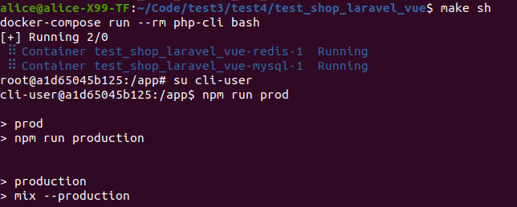
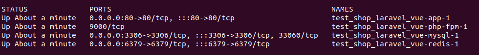

To run required docker and docker-compose 

in terminal run :
```
make init
```
and please run `npm run prod` from `cli-user` 
```
make sh 
# su cli-user
$ npm run prod
```


(maybe later i can  to fix that problem)

Result:




https://user-images.githubusercontent.com/9290549/170842738-b78cf180-e387-446b-b499-a561609dc00d.mp4

